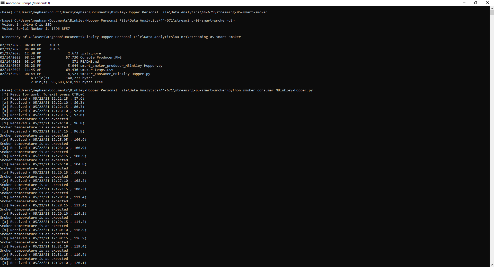
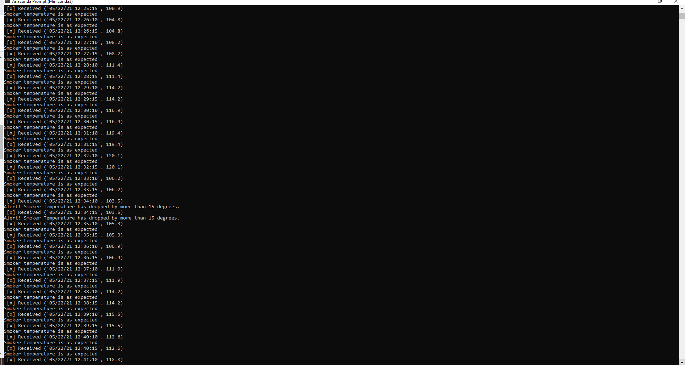
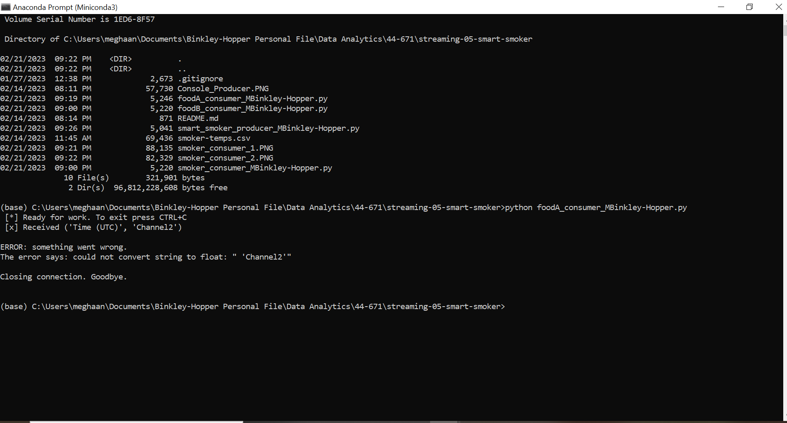
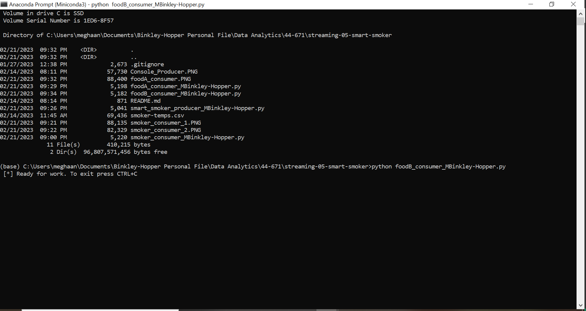

# streaming-05-smart-smoker
> Use RabbitMQ to send messages with time and date stamps and temperature for a smoker and two items of food in order to monitor the temperature for optimal cooking conditions. 

One process will create task messages. Multiple worker processes will share the work. 

## RabbitMQ Admin 

RabbitMQ comes with an admin panel. When you run the task emitter, reply y to open it. 

## Execute the Producer

1. Run smart_smoker_producer_MBinkley-Hopper.py (say y to monitor RabbitMQ queues)

Explore the RabbitMQ website.

## Execute Smoker Consumer / Worker

1. Run smoker_consumer_MBinkley-Hopper.py

2. Push CTRL+C to quit.

## Execute Food A Consumer / Worker

1. Run foodA_consumer_MBinkley-Hopper.py

2. Push CTRL+C to quit.

## Execute Food B Consumer / Worker

1. Run foodB_consumer_MBinkley-Hopper.py

2. Push CTRL+C to quit.

## Reference

- [RabbitMQ Tutorial - Work Queues](https://www.rabbitmq.com/tutorials/tutorial-two-python.html)

## Screenshot

See a running example here:
1. Producer

2. Smoker Consumer

3. Food A Consumer

4. Food B Consumer
